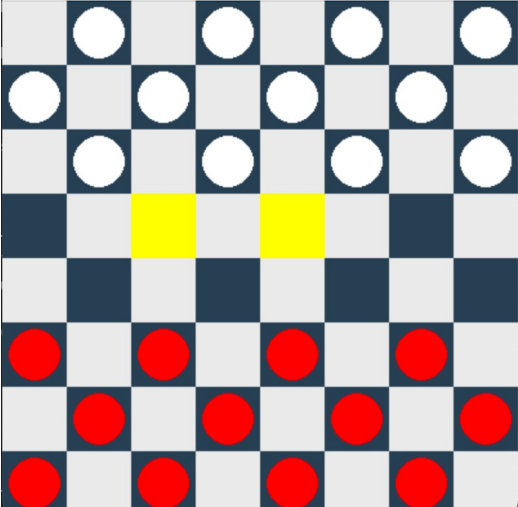

# AI Checkers

## Overview

Our first step in creating the AI checkers was to establish a standard checkers game, complete with the necessary rules and a graphical user interface (GUI).

### 1. Piece Object

We began by defining a `Piece` object to represent each individual piece on the checkers board. Each piece contains attributes such as its associated row and column, color (red or white), and whether it has been crowned as a king.

### 2. Board Object

Next, we developed a `Board` object to manage the state of the checkers board. The board is represented internally using a NumPy array, facilitating efficient manipulation and evaluation of the game state. This object also tracks the number of red and white pieces remaining after each move, as well as which player's turn it is.

### 3. Game Object

The final step involved creating a `Game` object responsible for coordinating the gameplay. This object keeps track of the turns, players, and valid moves throughout the course of the game. It maintains a record of each move made, facilitates the transition between players' turns, and ultimately determines the winner based on the state of the board array.

## Initial Board Configuration

The following figure shows the initial board configuration for white to make a move along with valid moves the selected piece can make:

## Neural Network Player

We implemented a three-layer feed-forward neural network to act as a player in our checkers game. The network architecture includes an input layer, three hidden layers, and an output layer. The dimensions of the hidden layers are (32, 90), (90, 40), and (40, 10) nodes, respectively, following the approach outlined in [2]. The output layer consists of a single node, representing the predicted outcome of the current game state, which serves as a score heuristic in our minimax tree.

The input to the neural network is a 32 × 1 vector derived from the playable positions of the board. Each value in the vector represents the presence of the player's draughts pieces (1), the opponent player's draughts pieces (-1), their kings (3 and -3), or an empty position (0).

The weights and biases for each layer are initially randomly generated and passed through a tanh function to introduce non-linearity into the network. This approach helps the network understand complex relationships between inputs and outputs while maintaining a balance between positive and negative inputs.

To optimize the search space for the evolutionary algorithm (EA), we adjusted the weights to lower dimensions until achieving desirable results.

## Minimax Algorithm using Alpha-Beta pruning

Each board state represents a node in the game tree, with edges representing possible moves. The minimax algorithm recursively evaluates states using our neural network's output. Alpha-beta pruning reduces the search space, returning the best move and its evaluation score.

## Evolutionary Algorithm for Training

During the training process, the evolutionary algorithm is used to optimize the weights and biases of the neural network. The population of neural networks is evolved over several generations, with the individuals selected to produce offspring for the next generation. The fitness of each network is evaluated based on its performance in a series of games of checkers against other networks in the population. The Evolutionary Algorithm works as follows:

- **Initialization:** The chromosome population is randomly initialized, containing weights and biases for three layers. Each chromosome represents a neural network. Thus, the population contains neural networks.
- **Fitness:** The fitness of each neural network is evaluated based on the number of wins achieved. This serves as a measure of the network's performance in games of checkers.
- **Selection Schemes:** Binary tournament is used for both parent and survivor selection to optimize computational efficiency.
- **Crossover:** Uniform crossover is employed to create offspring, promoting diversity and exploration of the search space.
- **Mutation:** Mutation involves randomly changing the values of a small subset of the weights and biases in the network.

